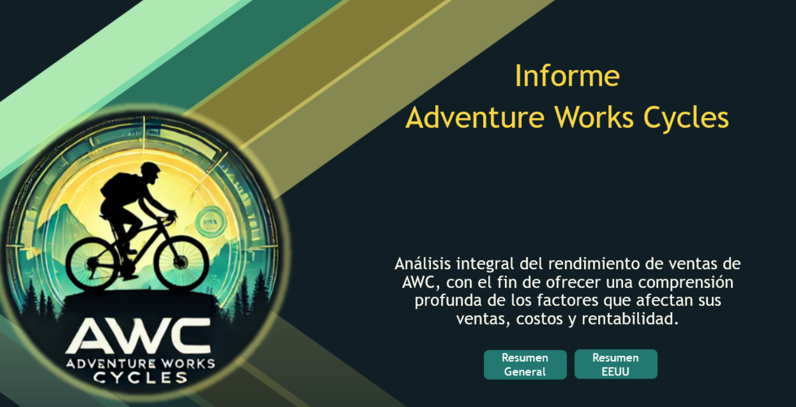

# 📊 Análisis de Ventas de AdventureWorks con Power BI

Este proyecto fue desarrollado de forma individual como parte del **Módulo 3** de la carrera de **Data Analytics en Henry**.  
Se centra en el análisis integral del rendimiento de ventas de la empresa ficticia **AdventureWorks (AWC)** con el objetivo de comprender en profundidad los factores que afectan sus ingresos, costos y rentabilidad.

---

## 🎯 Objetivo del Proyecto

El objetivo principal es **ofrecer una visión clara y estructurada de los datos históricos de ventas**, identificando patrones clave de rendimiento que puedan respaldar decisiones estratégicas.

Mediante el uso de **Power BI**, se visualizan métricas críticas como:

- Ingresos totales
- Costos de mercancía vendida (COGS)
- Utilidad bruta y utilidad neta
- Costos operacionales y de envío
- Análisis por país, región, producto y categoría

---

## 🧠 Principales Hallazgos

- 📈 **Tendencia de ingresos**: crecimiento sostenido de 2010 a 2013, con una caída puntual en 2012.
- 💰 **Rentabilidad estable**: la utilidad neta se mantiene en torno al **30%** anualmente, reflejando eficiencia en la estructura de costos.
- 🌎 **Estados Unidos** lidera tanto en clientes como en ingresos, seguido por Australia y Reino Unido.
- 🚲 **Bicicletas** son los productos que generan más ingresos, aunque **accesorios** lideran en volumen de ventas y porcentaje de utilidad.
- 🗺️ **California, Washington y Oregon** son las provincias con mayor rendimiento. Se identificaron provincias con bajo desempeño que podrían ser foco de campañas personalizadas.

---

## ✅ Recomendaciones

1. **Consolidar estrategias actuales** en mercados de alto rendimiento (EE.UU.), reforzando campañas en zonas de bajo crecimiento.
2. **Invertir en Accesorios**, productos con alta rotación y excelente margen de ganancia.
3. **Analizar la estacionalidad** para anticipar ciclos de alta y baja demanda.
4. **Estudiar provincias de bajo rendimiento** para adaptar campañas e identificar oportunidades de crecimiento regional.

---

## 📌 Herramientas Utilizadas

- **Power BI**: visualización y modelado de datos.
- **SQL**: extracción y transformación de datos desde la base de AdventureWorks.
- **Excel**: apoyo en limpieza y validación previa.

---

## 📅 Período Analizado

- Años: **2010 a 2013**
- Fuente: base de datos **AdventureWorks DW** (Microsoft)

---

## 🖼️ Vista Previa del Dashboard

  

---

## 🚀 ¿Por qué es relevante este proyecto?

Este análisis demuestra **la capacidad de interpretar datos complejos**, generar visualizaciones efectivas y traducir hallazgos técnicos en **recomendaciones accionables para la toma de decisiones empresariales**.

---
